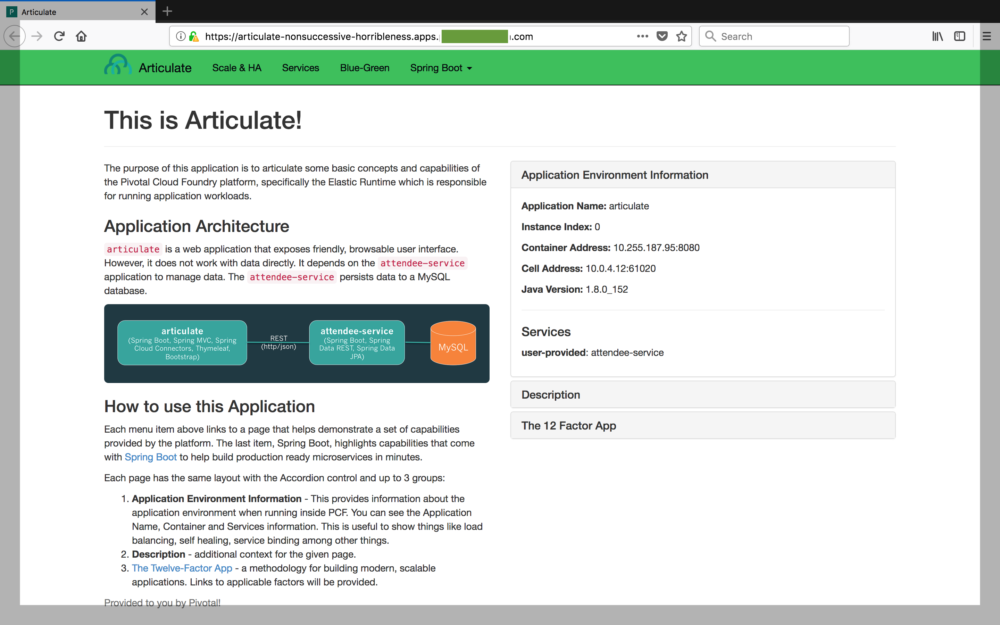
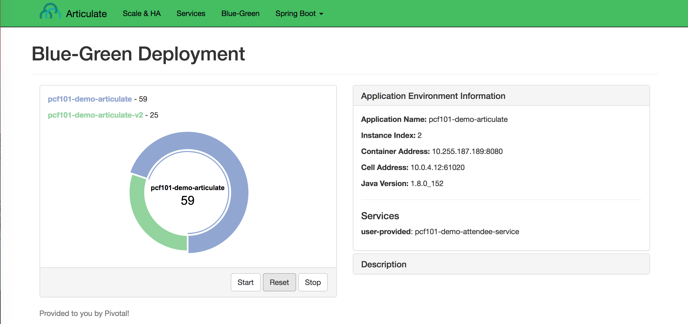

# Blue-Green deployment across multiple clouds

The main purposes here are to demonstrate Blue-Green deployment of Articulate application across two clouds. This tutorial can be easily expanded to include Atendee services as part of the deployment and also scale it to more than 2 clouds. Follow the steps below for setup and execution of this tutorial.

## Setup concourse locally

  1. Setup Concourse locally by following `Getting Started` section in https://concoursetutorial.com/ 
  2. Mirror this repository to your account as explained in https://help.github.com/articles/duplicating-a-repository/
  3. Clone your newly created repository to your local desktop / laptop by executing the git clone command

```
$ git clone https://<<your-repo>>/pcf101-articulate-attendee.git
```
  
 4. Edit `vars.yml` file under articulate\ci folder and update the following variables to point to your cloud instances

```
pcf-api: api.sys.pcf.aws.pcfjourney.com
pcf-username: admin
pcf-password: xxxxxxxxxxxxx
pcf-domain: apps.pcf.aws.pcfjourney.com
pcf-organization: UT
pcf-space: dev
...
cloud2-pcf-api: api.run.haas-90.pez.pivotal.io
cloud2-pcf-username: admin
cloud2-pcf-password: xxxxxxxxxxxx
cloud2-pcf-domain: cfapps.haas-90.pez.pivotal.io
cloud2-pcf-organization: UT
cloud2-pcf-space: dev

```
 5. Edit pipeline.yml file under articulate/ci folder and modify the resources section to point to your github repo
 
```
# GIT
- name: resource-git
  type: git
  source:
    uri: https://github.com/<<your repo>>/pcf101-articulate-attendee
    branch: master

```
 6. Install pipeline using the following command from the project root directory
 
```
fly -t tutorial set-pipeline -p <<pipeline-name>> -c articulate/ci/pipeline.yml -l articulate/ci/vars.yml

```

 7. Naviage to the pipleine UI (http://127.0.0.1:8080/teams/main/pipelines/<<Pipeline-name>> and trigger a build by clicking     on + sign on "build and deploy" task page as shown below
  
 
 
 
 
 
Now, the `articulate` webapp is already serving on port `8080`
and the backend app `attendee`, providing RESTful services for `articulate`,
will be serving on port `8181`, which is exactly the default setting in `articulate`.


Go to the http://localhost:8080 in your browser and you should see below screen:


## To Run on Cloud Foundry

Assuming you have logged into your Cloud Foundry targeting the proper organization and space.

```
$ ./mvnw package

$ cf push -f attendee/manifest.yml
$ cf push -f articulate/manifest.yml
```

Now they're working independently.
Copy the route generated for `attendee` app and it's time to let `articulate` app talks to `attendee` service:

```
$ cf cups pcf101-demo-attendee-service -p uri
    uri> <KEY IN URL OF ATTENDEE APP + "/attendees" AND ENTER, e.g. https://pcf101-demo-attendee.apps.mycompany.com/attendees>
$ cf bind-service pcf101-demo-articulate pcf101-demo-attendee-service
$ cf restage pcf101-demo-articulate
```

You can visit the `articulate` app by visiting the route generated:




> Tips: 
> 1. It's recommended to try it out in [Pivotal Web Services](https://run.pivotal.io)
> 2. To simplify the process, please refer to `start.sh` for how to make all these in one simple command
> 3. Please refer to `articulate/manifest-with-service.yml` for how to add service binding directly
> within the yaml file so that the service binding process can be fully automated.


By default, the `attendee` app uses an embedded H2 database to persistent attendee records.
If you want to use MySQL, it's just some commands away:

```
$ cf create-service <MYSQL SERVICE> <MYSQL PLAN> <MYSQL_SERVICE_INSTANCE_NAME>
$ cf bind-service pcf101-demo-attendee <MYSQL_SERVICE_INSTANCE_NAME>
$ cf restage pcf101-demo-attendee
```


## Blue Green Deployment

As PCF has layered routing mechanism and provides powerful APIs for the routing control, blue-green deployment becomes very straightforward:

```
$ DOMAIN=<YOUR APPS DOMAIN>
$ cf push -f articulate/manifest-v2.yml --no-route
$ cf map-route pcf101-demo-articulate-v2 ${DOMAIN} -n pcf101-demo-articulate

$ cf scale pcf101-demo-articulate -i 1
$ cf scale pcf101-demo-articulate-v2 -i 3

$ cf unmap-route pcf101-demo-articulate ${DOMAIN} -n pcf101-demo-articulate
```

Eventually we can delete the old version of app and rename the new version:

```
$ cf delete pcf101-demo-articulate -f
$ cf rename pcf101-demo-articulate-v2 pcf101-demo-articulate
```

The `articulate` app provides good illustration about the blue-green process.



> Tips: 
> 1. This process can be significantly simplified if you use `Autopilot` CF plugin, see [here](https://github.com/contraband/autopilot);
> 2. Refer to [bluegreen-autopilot.sh](./bluegreen-autopilot.sh) for how to use `Autopilot` to perform blue-green deployment


## CI/CD By Concourse

There is CI/CD pipeline for [Concourse](http://concourse.ci) built in.


To try it out:

```
$ vi ../_vars.yml
$ fly -t concourse set-pipeline -p pcf101-demo-articulate-attendee -c articulate/ci/pipeline.yml -l ../_vars.yml
```

> Note: Below is the sample `_vars.yml`:
```
app-name: pcf101-demo-articulate
app-host: pcf101-demo-articulate

pcf-api: <PCF API ENDPOINT>
pcf-username: <PCF USER>
pcf-password: <PCF PASSWORD>
pcf-domain: <PCF APP DOMAIN>
pcf-organization: <PCF ORG>
pcf-space: <PCF SPACE>
```


## Clean Up

To clean up the env, simply issue below commands:

```
$ cf delete pcf101-demo-articulate -r
$ cf delete pcf101-demo-attendee -r
$ cf delete-service pcf101-demo-attendee-service
```

# Credits

This project is originated from https://github.com/pivotal-education/pcf-articulate-code
